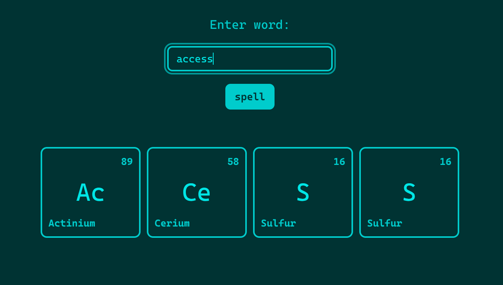

# Periodic Table Speller

A simple vanilla javascript project that displays user input as periodic table elements, if possible.

To run the application, follow these steps:

1.  Clone the repository:

    `git clone https://github.com/programmingenjoyer219/user-input-periodic-table.git`

2.  Start a server:

    `npx http-server`

    Or use the live server vscode extension.

---

